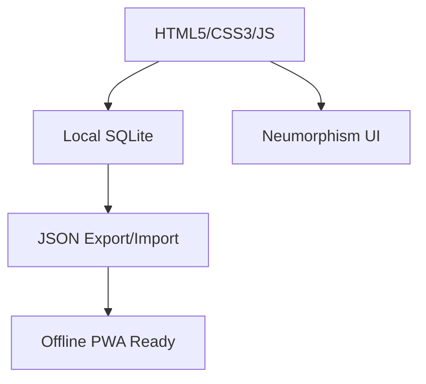

<div align="center">

# 💪 Habit Tracker & Task Manager

</div>

<div align="center">
  
**Track your habits, plan your tasks, crush your goals!** 🚀

</div>

## ✨ Features

| Feature | Description |
|---------|-------------|
| **📱 Daily Tasks + Habits** | Plan today's study/coding/gym + track water, reading |
| **📊 Analytics Dashboard** | Performance score, achievements, streak tracking |
| **📅 Weekly Matrix** | Visual 7-day habit consistency grid |
| **🎨 Custom Themes** | 6+ themes (Purple, Pink, Blue, Green, Black) |
| **💾 JSON Backup** | Export/Import + SQLite database inspector |

## 🚀 Quick Start

```bash
# Clone
git clone https://github.com/ITACHI-01-cyber/Task-manager-with-habit.git
cd Task-manager-with-habit

# Run (No install needed!)
# Option 1: Double-click index.html ✅
# Option 2: VS Code Live Server
# Option 3: npx live-server .

```markdown

```

## 🛠 Tech Stack




## 🔧 Customization

| Setting | Options |
|---------|---------|
| **Color Themes** | 🟣 Purple, 🩷 Pink, 🔵 Blue, 🟢 Green |
| **Background** | Custom image upload |
| **Data** | Export/Import JSON, DB Inspector |

## 📁 Project Structure

```
Task-manager-with-habit/
├── index.html           # 🎯 Main app
├── style.css           # 🎨 Neumorphism styles
├── app.js              # ⚙️ Core logic
├── data/              # 💾 SQLite database
└── README.md          # 📖 This file
```
